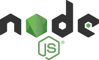

# React-Portfolio
## [Go to portfolio](https://ron-dunphy-portfolio.herokuapp.com/)

This Portfolio is built with a React.js frontend, using JavaScript for logic, and webpack to configure loaders.  I have an about me section for some background, and a portfolio section that shows some of the recent projects that I've been working on.  I have apps built with Angular2, ReactJS, EJS templating, JQuery, and a chrome extension to show the different libraries that I have used when building software. 
I impliment BCrypt, when needed, to hash passwords for user protection and I use Express for all routing needs.

 |  | 
------------ | ------------- | ------------ 
Express for all routing needs. | React for front-end rendering. | NodeJS for all npm related needs.
